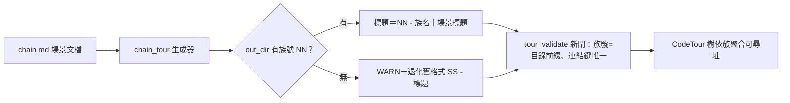

## Description

<!-- SECTION:DESCRIPTION:BEGIN -->
mosaic 的 CodeTour 樹裡幾十條導覽全擠在「01 -」開頭、找不到族（user 實證）——因為生成器標題只有族內序號沒有族號。本卡把 chain_tour 生成的標題改成「族號 - 族名｜場景標題」，樹依族聚合、游標連結與上一支／下一支導覽也恢復語義。**不做**：不批量重產 mosaic 既有 corpus（隨各族下次漂移修復自然換裝）、不動 manual tour、不把跨族導覽當功能承諾。設計經 codex＋GLM-5.3 雙顧問收斂，裁定全文在卡 Notes。

<!-- SECTION:DESCRIPTION:END -->

## Acceptance Criteria
<!-- AC:BEGIN -->
- [ ] #1 - [ ] 新模板：fixture 族號目錄＋manifest family label → title 全等 `NN - label｜heading`（多族／單族兩 case）
- [ ] 退化路徑：out_dir 無 NN → title 為 `{SS} - heading`＋stderr WARN（既有 s5_chain_tour.rs:192/:196 斷言轉為退化釘樁原樣通過）
- [ ] label 雙源衝突（manifest vs basename 不一致）→ fail-loud 非零退出
- [ ] label 缺雙源 → 收摺 `NN - heading`＋WARN
- [ ] label 槽含 ASCII `-` → 生成結果換 `－`＋WARN；heading 槽含 `-` → 原樣保留＋WARN 印有效截斷鍵
- [ ] tour_validate：族號制 title NN≠目錄前綴 → FAIL；新格式 ts_key 撞鍵 → FAIL；legacy 撞鍵 → WARN
- [ ] NN regex 三位數 case（`100-` 族）解析為 100 非 10
- [ ] `cargo test` workspace 全綠
- [ ] 消費端：模板輸出對 mosaic .tours/arch/ 實檔格式逐字一致（實檔比對）
- [ ] 回執：completed 寄 code-reality-marshal＋mosaic-primary（含實測證據錨點）
<!-- AC:END -->

## Implementation Plan

<!-- SECTION:PLAN:BEGIN -->
〔baseline：code-reality 7e408dd〕
〔已決策勿重辯：①模板形＝`NN - label｜heading`（A 案；codex job-murlmtfv-rrgzj0＋GLM-5.3 job-murlmy4u-bgj54c 收斂——B `NN-SS - `／C `NN.MM - ` 形使上游 getTourTitle `^#?\d+\s-`、Prev/Next `^#?(\d+)\s+-`、CR ts_key_re、tour_upgrade num_re 四組 regex 全不匹配＝靜默退出編號制）②NN 取 dup-family redirect 後 final out_dir basename，regex `^(\d{2,})`（防 `100-label` 誤剖）③label 解析序＝manifest `[family."NN"]` label（tour_manifest extra roundtrip 只讀）→ basename `NN-` 後綴 → 皆缺收摺 `NN - heading`＋單 WARN；**雙源在場且不一致＝fail-loud**（drift 禁優先序蓋掉——codex invariant）④out_dir 無 NN＝WARN＋退化 `{SS} - heading`（WARN 須指名修法：md 改名 NN-label.md 或顯式 --out-dir）；退化僅影響 title、manifest provenance 照寫 ⑤分槽：label 槽生成器可控——ASCII `-` 換 `－`＋WARN；heading 槽作者散文不改寫——生成時 WARN 印有效截斷鍵 ⑥`｜`＝U+FF5C 契約字面（禁 ASCII `|`）⑦族內檔名維持 `01.tour`（init_scan 數字檔名→chain_tour 猜測依賴）⑧存量不批量重產、manual tour 不動、tour_upgrade N→Vec 加固範圍外（revive_crossrefs 1:1 map 換形為既有退化、產物過 check_links 恰一閘；列觀察項）⑨上游 Prev/Next 跨族導覽（N±1 零填充匹配）不做功能承諾 ⑩ts_key 唯一性閘分級：族號制（新格式）title 撞鍵＝FAIL；legacy `SS - ` 過渡期撞鍵＝WARN（呼應 mosaic「過渡期新舊並存可接受」存量策略；全遷移後可升 FAIL）〕
範圍：crates/code-reality/src/chain_tour.rs（write_tours 模板＋NN/label 解析＋WARN 面；:684 doc comment NN/SS 詞彙重寫）；crates/code-reality/src/tour_validate.rs（族號==目錄前綴閘＋ts_key 唯一性分級閘）；tests/s5_chain_tour.rs＋tests/s5_tour_trio.rs（既有釘樁 :192/:196 轉退化路徑釘＋新增 fixtures：redirect 後取目標族 NN、basename 後綴含 `-`、三位 NN、無 NN 退化、label 雙源衝突 fail-loud、新格式撞鍵 FAIL）。實作走 worktree＋spawned implementation work unit（AIR-135 系 execution contract；crates/ 主幹直改由 admission guard deny——marker 68d7636）。mosaic 對接面：模板落地後其重產自然接管格式；validator 對其 .tours/arch/ 實檔跑綠為消費端驗收項。
<!-- SECTION:PLAN:END -->

## Implementation Notes

<!-- SECTION:NOTES:BEGIN -->
設計討論收斂記錄（2026-10-03）：codex 腿 job-murlmtfv-rrgzj0（chatgpt-web/high）＋GLM-5.3 腿 job-murlmy4u-bgj54c（plan tier isolated，自行碼面查證：tour_upgrade.rs:287-303 key_by_num、tour_manifest.rs:114 extra roundtrip、s5 fixtures out_dir 無 NN、生成器零 #codetour: 內嵌）。五題全收斂 A 案；分歧點裁決：Q3 採 GLM 分槽（label 改寫/WARN、heading 不改寫/WARN＋印截斷鍵、ts_key 撞鍵 FAIL）非 codex 全 canonicalize（heading 是作者散文）；Q4 缺源採 GLM 收摺＋WARN、雙源衝突採 codex fail-loud。來源鏈：mosaic DRAFT-42 正本（envelope 0c1a50c2／message 5cef1385）＋dogfood addendum（e892f39f）寄 code-reality-marshal；user 裁決「scbus 給 CR 讓他分析開卡實作」＋「5.3 codex 討論後開卡」＋「開卡後 WT 做，AIR-135 系作法」。上游事實驗證：vsls-contrib/codetour main getTourTitle split("-")[1]（utils.ts:37-43）、link key 等值（player/index.ts:92）、Prev/Next 數字走訪（:206-224）、樹 label=raw title（nodes.ts:29）。
<!-- SECTION:NOTES:END -->
